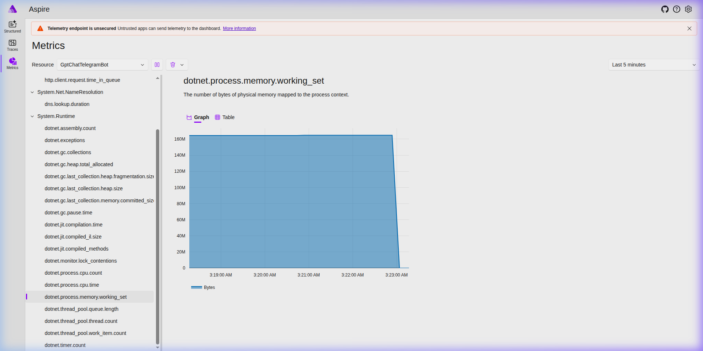
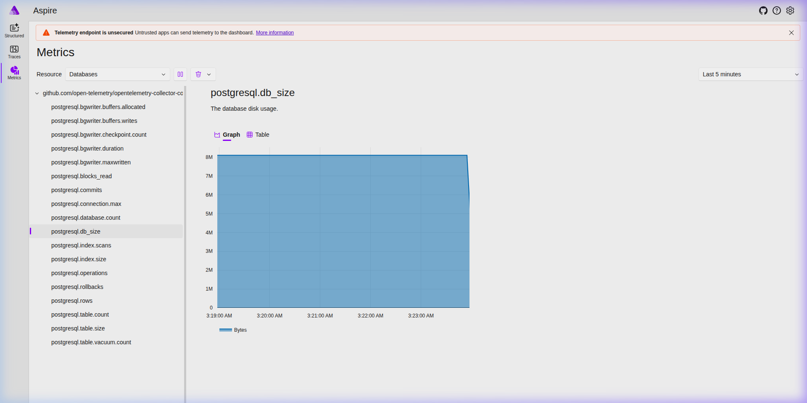
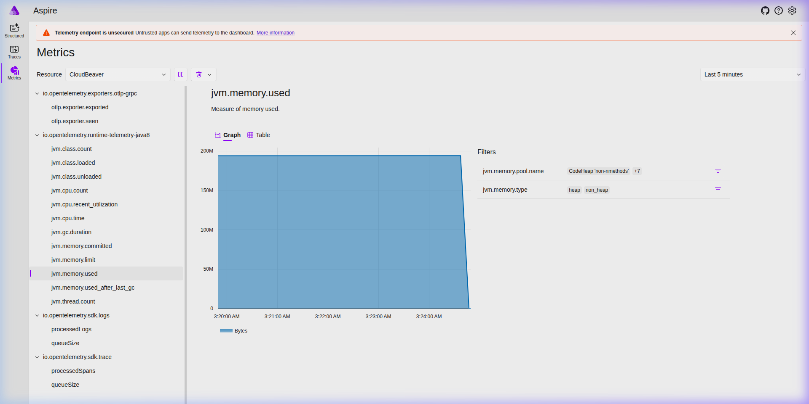
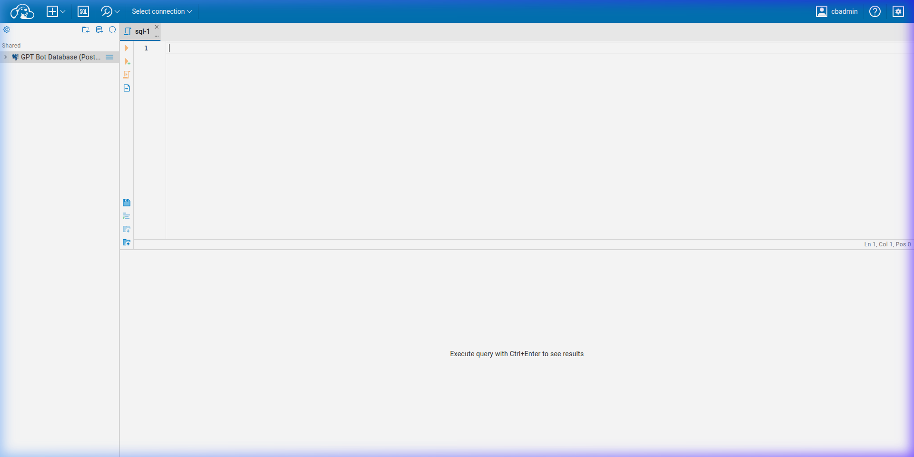
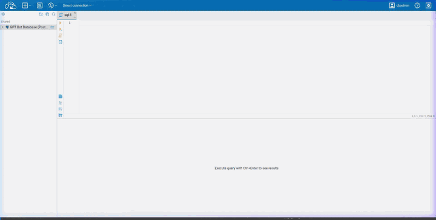

# Observability — Aspire Dashboard & CloudBeaver

> **See also:** [Ukrainian version → OBSERVABILITY.uk.md](OBSERVABILITY.uk.md)

This document explains how to monitor the GptChatTelegramBot using the built-in observability stack:

- **Aspire Dashboard** — real-time metrics, traces, and structured logs from all services
- **CloudBeaver** — web-based database manager for browsing and querying the bot's database

---

## Table of Contents

- [Architecture Overview](#architecture-overview)
- [Aspire Dashboard](#aspire-dashboard)
  - [Enabling the Dashboard](#enabling-the-dashboard)
  - [Structured Logs](#structured-logs)
  - [Traces](#traces)
  - [Metrics](#metrics)
- [CloudBeaver](#cloudbeaver)
  - [First Login & Setup](#first-login--setup)
  - [Connecting to the Database](#connecting-to-the-database)
  - [Browsing Tables](#browsing-tables)
  - [Running SQL Queries](#running-sql-queries)

---

## Architecture Overview

When the `aspire` profile is active, telemetry flows from all services into a single dashboard:

```
GptChatTelegramBot  ──── OTLP/gRPC ────►
PostgreSQL          ──── OTel Collector ►  Aspire Dashboard  :18888
CloudBeaver         ──── Java Agent ────►
MySQL/MSSQL         ──── OTel Collector ►  (errors when not running — expected)
```

| Service | What is collected | Protocol |
|---|---|---|
| **GptChatTelegramBot** | .NET Runtime metrics, HTTP traces, structured logs | OTLP/gRPC (port 18889) |
| **Databases** | PostgreSQL/MySQL/MSSQL metrics (connections, rows, db size…) | OTel Collector → OTLP |
| **CloudBeaver** | JVM metrics, HTTP request traces | OTel Java Agent → OTLP |

---

## Aspire Dashboard

### Enabling the Dashboard

Add `aspire` to your `COMPOSE_PROFILES` in `.env`:

```env
COMPOSE_PROFILES=postgres,cloudbeaver,aspire
```

Then start the services:

```bash
docker compose up -d
```

The dashboard will be available at **http://localhost:18888** (port is configurable via `ASPIRE_PORT`).

> **Note:** The default configuration uses `Unsecured` auth mode — safe for local development.  
> For production, [configure authentication](https://learn.microsoft.com/en-us/dotnet/aspire/fundamentals/dashboard/configuration#openid-connect-authentication).

---

### Structured Logs

The **Structured Logs** page shows all log entries from all services in real time.


**Features:**
- Filter by **resource** (GptChatTelegramBot, CloudBeaver…)
- Filter by **log level** (Information, Warning, Error, Critical)
- Full-text search across message content
- Click any row to expand structured properties

---

### Traces

The **Traces** page shows distributed trace spans — useful for tracking HTTP requests through the system.

> 💡 The animation above also shows the Traces and Metrics pages.

**Features:**
- Filter by resource, trace duration, and status
- Click a trace to see the full span tree with timing breakdown
- HTTP client calls (to Telegram API, OpenAI) are automatically traced

---

### Metrics

Use the **Resource** dropdown to switch between:

#### GptChatTelegramBot — .NET Runtime



Key metrics:
- `dotnet.process.memory.working_set` — memory usage
- `dotnet.process.cpu.time` — CPU consumption
- `dotnet.gc.collections` — garbage collector activity
- `http.client.request.duration` — Telegram/OpenAI API call latency
- `dotnet.thread_pool.queue.length` — thread pool pressure

#### Databases — PostgreSQL



Key metrics (collected by OTel Collector every 30s):
- `postgresql.db_size` — total database size in bytes
- `postgresql.rows` — rows inserted/updated/deleted/hot_updated
- `postgresql.commits` / `postgresql.rollbacks` — transaction rate
- `postgresql.connection.max` — connection pool status
- `postgresql.bgwriter.*` — background writer activity

#### CloudBeaver — JVM



Key metrics (collected by OTel Java Agent):
- `jvm.memory.used` — heap and non-heap memory usage
- `jvm.gc.duration` — garbage collection pauses
- `http.server.request.duration` — CloudBeaver UI response time

---

## CloudBeaver

CloudBeaver is a web-based database manager pre-configured with a connection to the bot's database.

### First Login & Setup

1. Ensure `cloudbeaver` profile is active in `COMPOSE_PROFILES`
2. Open **http://localhost:8978** (port configurable via `CLOUDBEAVER_PORT`)
3. On first launch, complete the setup wizard:
   - Choose a server name (any)
   - Create an admin account — remember these credentials!
4. Log in with your admin credentials



---

### Connecting to the Database

The **GPT Bot Database (PostgreSQL)** connection is pre-configured.  
When you first try to expand it, a **Database Authentication** dialog appears:

| Field | Value |
|---|---|
| User name | value of `POSTGRES_USER` in `.env` (default: `postgres`) |
| User password | value of `POSTGRES_PASSWORD` in `.env` |

> **Tip:** Check the **"Don't ask again during the session"** checkbox to avoid re-entering credentials.

---

### Browsing Tables

After connecting, expand the tree:

```
GPT Bot Database (PostgreSQL)
└── Databases
    └── gpt_chat_bot
        └── Schemas
            └── public
                └── Tables
                    ├── AIBilingItem
                    ├── BalanceHistories
                    ├── CachedAIModels
                    ├── CachedTranslations
                    ├── Messages
                    ├── TelegramChatInfos
                    └── TelegramUserInfos
```



Double-click any table to open a **data viewer** with pagination and filtering.

---

### Running SQL Queries

Click the **SQL** button in the top toolbar to open an SQL editor.

> 💡 The animation above demonstrates the full flow: login → expanding the database tree → writing and executing a SQL query.

**Example queries:**

```sql
-- List all registered users
SELECT "Id", "FirstName", "LastName", "Username"
FROM "TelegramUserInfos"
LIMIT 10;

-- Check recent messages
SELECT m."Content", m."CreatedAt", u."Username"
FROM "Messages" m
JOIN "TelegramUserInfos" u ON m."TelegramUserInfoId" = u."Id"
ORDER BY m."CreatedAt" DESC
LIMIT 20;

-- Check balance history
SELECT u."Username", b."Amount", b."CreatedAt"
FROM "BalanceHistories" b
JOIN "TelegramUserInfos" u ON b."TelegramUserInfoId" = u."Id"
ORDER BY b."CreatedAt" DESC
LIMIT 20;
```

**Keyboard shortcuts:**
- `Ctrl+Enter` — execute query
- `Ctrl+Space` — autocomplete
- `Ctrl+/` — comment/uncomment line

---

## Configuration Reference

All observability settings are in `.env` / `.env.example`:

| Variable | Default | Description |
|---|---|---|
| `OTEL_EXPORTER_OTLP_ENDPOINT` | `http://aspire-dashboard:18889` | OTLP endpoint for the bot |
| `ASPIRE_PORT` | `18888` | Aspire Dashboard UI port |
| `CLOUDBEAVER_PORT` | `8978` | CloudBeaver UI port |
| `CLOUDBEAVER_JAVA_TOOL_OPTIONS` | *(empty)* | Set to `-javaagent:/otel-agent/opentelemetry-javaagent.jar` to enable OTel for CloudBeaver |
